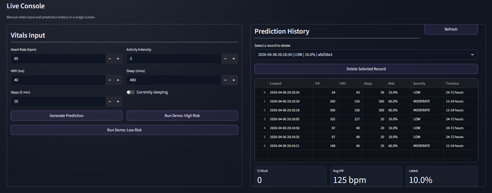
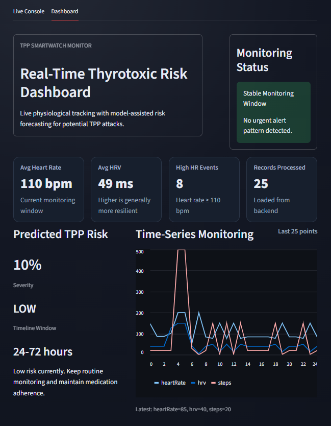

# TPP Monitoring Service 

Full-stack AI deeplearning software for Thyrotoxic Periodic Paralysis monitoring with smartwatch data ingestion. This is to monitor the behavior of your body that predicts the severity and timeline of TPP attacks. It also advises you when to take your Propranolol and Thiamazole tablets and how you would prepare for the attack. 


- Flask API service
- Streamlit interactive frontend
- DAO + Service + Model layered structure
- SQLite persistence (shared by API and UI)
#


# MANUAL INPUT FOR TESTING




<p align="center">
  
</p>

## Architecture

```
config/   -> DB connection / infrastructure
model/    -> Data classes (VitalsInput, Prediction)
dao/      -> Database access (CRUD)
service/  -> Business logic (risk scoring + model loading)
routes/   -> Flask routes (API endpoints)
ui/       -> Streamlit tabs (interactive frontend)
app.py    -> Flask app entrypoint
streamlit_app.py -> Streamlit app entrypoint
```
## Machine Learning Model
The risk prediction engine is built around a trained machine learning artifact (trained_model.pkl) serialized using Python's joblib/pickle protocol. The model is a supervised classifier trained on physiological feature vectors labeled with TPP attack risk levels. Four risk categories are defined: Low, Moderate, High, and Critical, corresponding to risk score ranges of 0–25%, 26–50%, 51–75%, and 76–100% respectively.


## Run With Docker Compose (single command)

From project root:

```bash
docker compose up --build
```

This starts:

- Flask API: http://localhost:5050
- Streamlit frontend: http://localhost:8501
- Shared SQLite DB volume (`tpp_data`)

To stop:

```bash
docker compose down
```

## Interactive Frontend Testing (No Smartwatch Needed)

Open Streamlit at http://localhost:8501

Use the **Vitals Input** tab to:

1. Enter manual vitals (heart rate, HRV, steps, etc.)
2. Click **Generate Prediction** to run TPP risk scoring
3. Use **Load Demo (High Risk)** and **Load Demo (Low Risk)** for mock scenarios
4. Review results in **Prediction History** and **Dashboard** tabs

This gives you fully interactive mock testing while smartwatch hardware is unavailable.
| Component                 | Technology               | Status      | Lines of Code |
|--------------------------|--------------------------|-------------|---------------|
| Flask REST API (app.py)  | Python / Flask           | Operational | ~46           |
| Streamlit Dashboard      | Python / Streamlit       | Operational | ~123          |
| DAO Layer                | Python / SQLite          | Operational | ~85           |
| Service Layer            | Python / Scikit-learn    | Operational | ~110          |
| Model Layer              | Python dataclasses       | Operational | ~40           |
| Routes Layer             | Flask Blueprints         | Operational | ~60           |
| UI Tabs (live_console, dashboard) | Streamlit components | Operational | ~180          |
| Visualization Notebook   | Jupyter / matplotlib     | Operational | 793 lines     |

## API Endpoints

- `GET /health` -> service health check
- `POST /predict` -> submit vitals and get TPP prediction
- `GET /history?user_id=<id>&limit=20` -> recent predictions for user

Example prediction request:

```json
{
  "user_id": "user-demo",
  "heart_rate": 138,
  "hrv": 18,
  "steps": 5,
  "activity_intensity": 1,
  "sleep_duration_mins": 420,
  "is_sleeping": false,
  "source": "manual"
}
```

## Local Run (without Docker)

```bash
pip install -r requirements.txt
python app.py --port 5050
streamlit run streamlit_app.py --server.port 8501
```

## Notes

- The service attempts to load a trained artifact at `models/trained_model.pkl`.
- If model loading fails, fallback risk logic is used so interactive testing always works.
